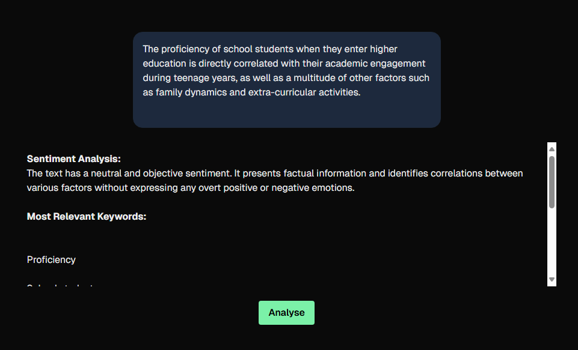

# Propeller Studios Pre-Interview Task
The following repository is submitted as part of the application process for Propeller Studios. It is a simple web application that provides the user with a sentiment analysis and keyword extraction of what they have typed in the prompt box.
## Setup & Usage
- Make sure you add a file in the root of this project called `.env.local` and put your Gemini API Key there. Gemini API Keys can be made for free. This will allow the application to make requests to Gemini/Google's endpoints. You specify it using the following syntax: `GEMINI_API_KEY = "your api key"`
- Ensure you have node v22.17.1 installed
- Ensure you have npm v10.9.2 installed
- Run `npm install` in the terminal to install all the necessary packages.
- Run `npm run dev` in the terminal and then visit the localhost page generated.

